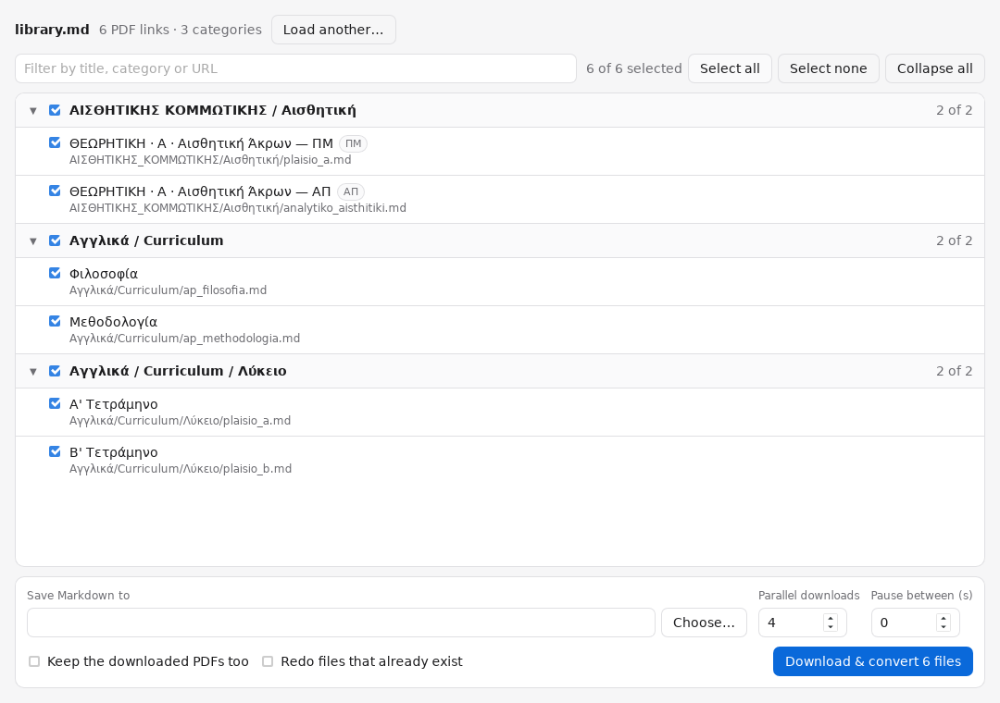

# pdf2md

Point it at a document full of PDF links and it gives you back a tree of Markdown
files, organised into the same categories the document used.

For each link it finds, pdf2md:

1. **parses** the document and picks out the links to online PDFs,
2. **fetches** the PDF over HTTP(S), checking it really is a PDF,
3. **keeps it in a temporary file** only for as long as the conversion takes,
4. **converts** it to Markdown with [Microsoft markitdown](https://github.com/microsoft/markitdown),
5. **writes** the result under `output/<category>/<subcategory>/<name>.md`.

The categories come from the document's own headings, so a link listed under
`## Physics` → `### Curriculum` lands in `output/Physics/Curriculum/`. Links in
Markdown tables get their title from the row and the column header, which is what
makes a table of anonymous `[PDF]` links usable.

## Two ways to use it

**The macOS app** — download it, load a document, tick what you want. Nothing to
install, no Python, no terminal.

> **[Download the latest release](https://github.com/Vibing101/PDF_DL_2_MD/releases/latest)**
> · **[User guide](docs/USER_GUIDE.md)**



**The command line** — the same converter, scriptable, and it runs anywhere
Python does. That is what the rest of this page covers.

## Install

Python 3.9–3.13. (markitdown's PDF backend depends on onnxruntime, whose wheels
do not cover 3.14 yet.)

```bash
python3 -m venv .venv && source .venv/bin/activate
pip install -r requirements.txt
```

Or install the CLI itself:

```bash
pip install -e .
```

## Quick start

```bash
# 1. See what it found — no downloads, nothing written
python -m pdf2md samples/mesi_genikh_library.md --dry-run | head

# 2. Try ten of them for real
python -m pdf2md samples/mesi_genikh_library.md -o output --limit 10

# 3. Run the lot, politely, keeping the PDFs as well
python -m pdf2md samples/*.md -o output --keep-pdfs pdfs --workers 4 --delay 0.5
```

Re-running is safe: files that already exist are skipped, so an interrupted run
picks up where it stopped. Use `--overwrite` to force a refresh.

## What the output looks like

```
output/
├── INDEX.md                     # every file, grouped by category
├── _manifest.json               # machine-readable report of the run
├── Αγγλικά/
│   └── Curriculum/
│       ├── ap_filosofia.md
│       └── ap_methodologia.md
└── ΑΙΣΘΗΤΙΚΗΣ_ΚΟΜΜΩΤΙΚΗΣ/
    └── Αισθητική/
        └── plaisio_mathisis_athk_s1_thaa_aisthitiki_akrwn.md
```

Every converted file starts with front matter recording where it came from:

```markdown
---
title: "ΘΕΩΡΗΤΙΚΗ · Α · Αισθητική Άκρων — ΠΜ"
source_url: "https://sch.cy/st/5/plaisio_mathisis_athk_s1_thaa_aisthitiki_akrwn.pdf"
categories: ["ΑΙΣΘΗΤΙΚΗΣ ΚΟΜΜΩΤΙΚΗΣ", "Αισθητική"]
document_type: "ΠΜ"
source_document: "mteek_analytika_library.md"
source_line: 20
pdf_bytes: 284913
pdf_sha256: "bf598fef…"
converted_at: "2026-09-26T13:02:49Z"
converter: "markitdown (via pdf2md 1.0.1)"
---

…the converted text…
```

`_manifest.json` lists every URL with its status, size, SHA-256, the files written
for it and the error message if it failed — useful for re-running just the failures.

## Input documents

Any Markdown, plain text or HTML file works. Anything else (`.docx`, `.pdf`,
`.xlsx`, …) is first run through markitdown, so a Word document listing links is
fine too.

Recognised link shapes:

| Shape | Example |
| --- | --- |
| Markdown link | `- Philosophy — [ap_filosofia.pdf](https://host/ap_filosofia.pdf)` |
| Markdown table | `\| THEORY \| A \| Aesthetics \| [PDF](https://host/lf.pdf) \|` |
| Autolink | `<https://host/file.pdf>` |
| Bare URL | `https://host/file.pdf` |
| HTML anchor | `<a href="https://host/file.pdf">Philosophy</a>` |

A link counts as a PDF when its URL path ends in `.pdf` (query strings and
fragments are ignored) or when the link text says PDF and the URL carries no other
file extension. `.zip`, `.docx`, images and web pages are left alone. Links with
no extension at all — `…/download/5521` — are only considered with `--probe`,
which asks each server with a `HEAD` request and keeps the ones answering
`application/pdf`.

## Options

Run `python -m pdf2md --help` for the full list. The ones that matter most:

| Option | Effect |
| --- | --- |
| `-o, --output-dir DIR` | where the Markdown tree goes (default `output`) |
| `-n, --dry-run` | print the plan (`path <TAB> url`) and stop |
| `--limit N` | stop after N unique PDFs — use it for a first trial |
| `--keep-pdfs DIR` | keep the downloaded PDFs in the same folder layout |
| `--overwrite` | redo files that already exist |
| `--max-category-depth N` | how many heading levels become folders (default 3) |
| `--include-top-heading` | treat the `#` title as a category too |
| `--flat` | no subfolders at all |
| `--name-from title` | name files after the link title instead of the URL |
| `--category-filter REGEX` | only categories matching the pattern |
| `--include-filter` / `--exclude-filter` | filter on the URL |
| `--probe` | consider extension-less links, confirmed with `HEAD` |
| `--workers N`, `--delay SECONDS` | parallelism, and a minimum gap between requests |
| `--max-bytes`, `--retries`, `--read-timeout` | download limits |
| `-v` / `-q` | more or less logging |

Exit code is `0` when everything converted, `1` when at least one PDF failed, and
`2` for a usage error.

## How it behaves

- **The same PDF under several categories** is downloaded and converted once, then
  written into each category folder.
- **Two different PDFs with the same filename** in one folder: the second gets a
  short hash of its URL appended, so nothing is silently overwritten.
- **Names keep their alphabet.** Greek headings stay Greek; only characters that
  break filesystems are replaced, and spaces become underscores.
- **Non-PDF responses are rejected.** A server answering with an HTML error page
  under a `.pdf` URL is recorded as a failure, not saved as Markdown.
- **Temporary PDFs are deleted** as soon as they are converted, unless
  `--keep-pdfs` is given.
- **Scanned PDFs** with no text layer are written with a note saying markitdown
  found no text, and counted as `converted_empty`. Run them through OCR
  (`ocrmypdf`, say) and convert those files again if you need their contents.

## Desktop app (macOS)

`desktop/` wraps all of this in a Tauri app: the same Python converter, bundled
as a self-contained binary the app talks to, so a user needs nothing installed.

- **Using it** — [docs/USER_GUIDE.md](docs/USER_GUIDE.md), written for people who
  will never open a terminal, including the Gatekeeper step the first launch
  needs because the app is unsigned.
- **Building and hacking on it** — [desktop/README.md](desktop/README.md): how
  the web view, the Rust shell and the Python sidecar fit together.

Disk images for both Mac architectures are attached to each
[release](https://github.com/Vibing101/PDF_DL_2_MD/releases), built by the
*build macOS app* workflow. To build one yourself, on a Mac:

```bash
cd desktop
bash scripts/build-sidecar.sh     # bundle the Python service (~75 MB)
npm install && npx tauri build    # produces pdf2md.app and a .dmg
```

The sidecar build ends by converting a PDF, so a bundle that cannot read PDFs
fails the build instead of shipping. You can check any bundle yourself:

```bash
desktop/src-tauri/binaries/pdf2md-service-<target-triple> --selftest
```

## Development

```bash
pip install -r requirements-dev.txt
python -m pytest
```

The test suite runs the whole pipeline — real HTTP against a local server on
`127.0.0.1`, real markitdown conversion of generated PDFs — so nothing reaches the
internet.

```
pdf2md/
├── extract.py    # document → PDF links + categories
├── download.py   # link → validated temporary file
├── convert.py    # temporary file → Markdown, via markitdown
├── naming.py     # titles and URLs → safe paths
├── pipeline.py   # plan, run in parallel, write the tree, report
├── cli.py        # argument parsing and the closing summary
└── service.py    # line-delimited JSON service, driven by the desktop app
```

## Samples

`samples/` holds two real link libraries with rather different shapes — one built
from nested headings and bullet lists, one from headings plus Markdown tables —
which is what the extractor is tuned against.

## Troubleshooting

- **`markitdown is required…`** — `pip install 'markitdown[pdf]'`.
- **Every PDF fails with "include the optional dependency [pdf]"** — markitdown
  is installed but its PDF backend is not. It imports `pdfminer`,
  `pdfminer.high_level` and `pdfplumber`, and reports this same error if any one
  of them is missing. `python -m pdf2md.service --selftest` converts a generated
  PDF and names the culprit.
- **Every download fails with a connection error** — check whether the network you
  are on allows the host; a corporate proxy or sandbox may block it.
- **`HTTP 403`** — some hosts refuse an unknown client; try
  `--user-agent 'Mozilla/5.0 …'` and a `--delay`.
- **Output is empty for some files** — those PDFs are scans; see above.
