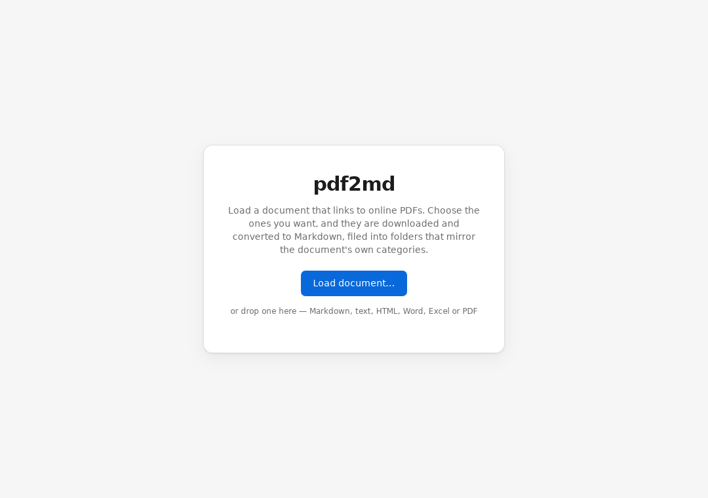
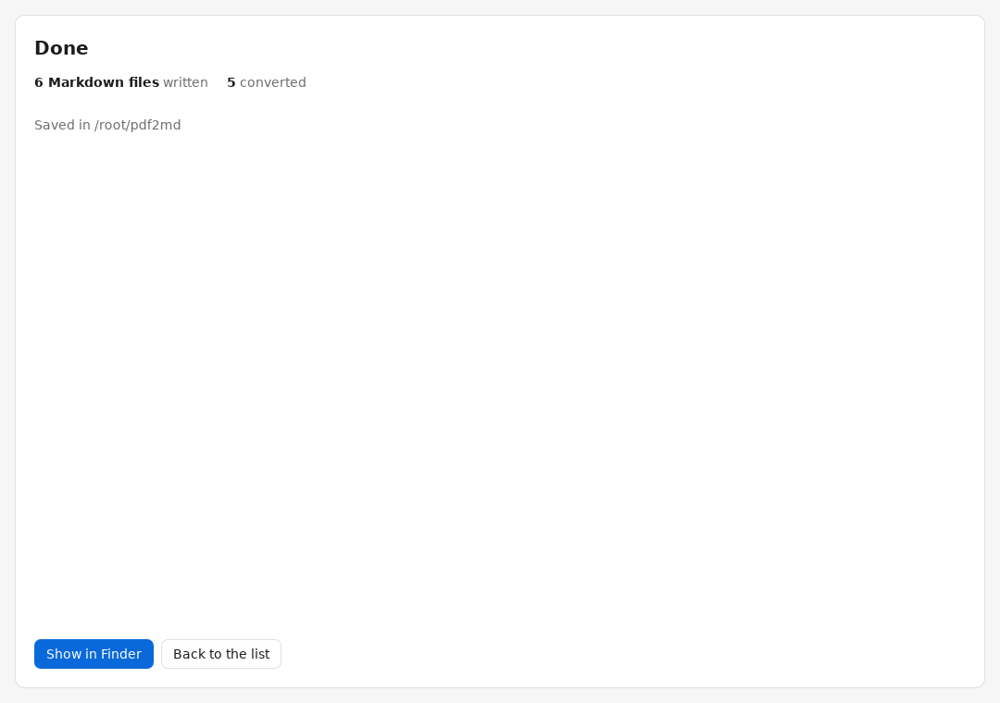

# pdf2md — user guide

pdf2md turns a document full of links to online PDFs into a tidy folder of
Markdown files. You load the document, tick the PDFs you want, and it downloads
each one and converts it to text, filing everything into folders that mirror the
document's own categories.

No setup, no Python, no command line — everything it needs is inside the app.

- [Installing](#installing)
- [The three steps](#the-three-steps)
- [What you get](#what-you-get)
- [What the statuses mean](#what-the-statuses-mean)
- [Tips](#tips)
- [If something goes wrong](#if-something-goes-wrong)

## Installing

### 1. Download the right file

Go to the [latest release](https://github.com/Vibing101/PDF_DL_2_MD/releases/latest)
and download one of:

| Your Mac | File |
| --- | --- |
| Apple silicon (M1, M2, M3, M4 …) | `pdf2md_<version>_aarch64-apple-darwin.dmg` |
| Intel | `pdf2md_<version>_x86_64-apple-darwin.dmg` |

Not sure which you have?  → **About This Mac**. If the **Chip** line says Apple
M-anything, take the Apple silicon one; if it says an Intel processor, take the
Intel one.

### 2. Install it

Open the `.dmg` and drag **pdf2md** into your Applications folder.

### 3. Open it the first time

The app is not signed with an Apple Developer certificate, so macOS blocks the
first launch and says it cannot check it for malicious software. This is
expected for unsigned apps, and you only have to get past it once:

- **Right-click** (or Control-click) the app → **Open** → **Open** again in the
  dialog that appears.

If macOS refuses even that, open Terminal and run:

```
xattr -dr com.apple.quarantine /Applications/pdf2md.app
```

Then open the app normally. Every launch after the first is just a double-click.

## The three steps

### Step 1 — Load your document



Click **Load document…** and pick the file, or drag it onto the window.

The document is anything that lists links to PDFs. Markdown, plain text and HTML
are read directly; Word, Excel and PDF files are converted first so their links
can be read too.

pdf2md finds a link when the address ends in `.pdf`, or when the link text says
PDF. Links to `.zip` files, images and ordinary web pages are ignored.

### Step 2 — Choose what you want


The links appear grouped by the headings they sat under in your document, so a
link listed under *Physics → Curriculum* shows up in that category. Each row
shows its title, sometimes a small badge for the document type, and underneath,
the path the file will be saved to.

- **Click a category name** to open or close it.
- **Tick a category's box** to select everything inside it.
- **Filter** narrows the list by title, category or web address as you type, and
  *Select all* then applies to just what is showing — handy for grabbing, say,
  every file with "Curriculum" in the name.
- **Nothing is selected to begin with**, deliberately: a document with a
  thousand links never starts downloading by accident.

Then, at the bottom:

- **Save Markdown to** — the folder the tree is written into. It defaults to a
  `pdf2md` folder in your Documents.
- **Parallel downloads** — how many files to fetch at once. 4 is a sensible
  default; lower it if a site is struggling.
- **Pause between (s)** — a wait between requests. Leave it at 0 normally; set
  half a second or so if you are fetching hundreds of files from one small site.
- **Keep the downloaded PDFs too** — also saves the original PDFs, in the same
  folder layout, under `_pdfs`.
- **Redo files that already exist** — off by default, so re-running only fetches
  what you do not already have.

### Step 3 — Convert

Click **Download & convert**. The progress bar shows overall progress and each
row gets its own status as it finishes. **Stop** halts the run after the
downloads already in flight — anything finished stays finished.



When it is done you get a summary, and **Show in Finder** opens the folder.
Anything that failed is listed with the reason.

## What you get

```
your output folder/
├── INDEX.md                      every file, grouped by category
├── _manifest.json                a record of the run, for tooling
├── Physics/
│   └── Curriculum/
│       ├── philosophy.md
│       └── methodology.md
└── Chemistry/
    └── term_a.md
```

Every converted file starts with a block recording where it came from:

```markdown
---
title: "Philosophy"
source_url: "https://example.org/ap_filosofia.pdf"
categories: ["Physics", "Curriculum"]
source_document: "library.md"
pdf_bytes: 284913
pdf_sha256: "bf598fef…"
converted_at: "2026-09-26T13:02:49Z"
---

…the converted text…
```

That means you can always trace a file back to the PDF it came from, and the
SHA-256 lets you tell whether a PDF has changed since you fetched it.

**INDEX.md** is the readable table of contents — every file, under its category,
as clickable links. **_manifest.json** is the same information for scripts.

## What the statuses mean

| Status | What happened |
| --- | --- |
| **converted** | Downloaded and converted. |
| **no text found** | The PDF is a scan — an image of a page with no text layer. Nothing to extract. Run it through OCR and convert it again. |
| **already there** | A file was already at that path, so it was left alone. Tick *Redo files that already exist* to replace it. |
| **download failed** | The file could not be fetched — a dead link, a server error, or the address did not actually serve a PDF. |
| **convert failed** | It downloaded, but could not be read — usually a damaged or password-protected PDF. |
| **stopped** | You pressed Stop before this one started. |

## Tips

- **Try a few first.** Tick one category, convert it, and look at the result
  before committing to a thousand files.
- **Re-running is safe and cheap.** Files that already exist are skipped, so if a
  run is interrupted, just run it again and it picks up where it stopped.
- **Be kind to small sites.** Fetching hundreds of files from one server is worth
  doing at 2 parallel downloads with a half-second pause rather than all at once.
- **The same PDF in two categories** is downloaded once and saved in both places.
- **Names keep their own alphabet** — Greek stays Greek — with only the
  characters that break folders replaced.

## If something goes wrong

**"pdf2md is damaged" or "cannot be opened"** — this is the unsigned-app block,
not a broken download. See [Open it the first time](#3-open-it-the-first-time).

**"No PDF links were found in this document"** — pdf2md only counts a link if
the address ends in `.pdf` or the link text says PDF. If your document links to
pages that *lead* to PDFs rather than to the files themselves, there is nothing
for it to fetch.

**Everything fails to download** — check the site opens in your browser. A VPN,
a captive portal or a site that blocks unknown clients will stop pdf2md the same
way it would stop any download.

**A file converted but is empty** — that PDF is a scan with no text layer; see
*no text found* above.

**"The converter did not start"** — the app's bundled converter could not launch.
Re-download the app; if it persists, please open an issue with what macOS
version you are on.

**Some files failed and you want to retry just those** — run the same document
again with the same output folder. The successful ones are skipped and only the
failures are attempted.

---

Prefer the command line, or want to run this on Linux or Windows? The same
converter ships as a CLI — see the [README](../README.md).
